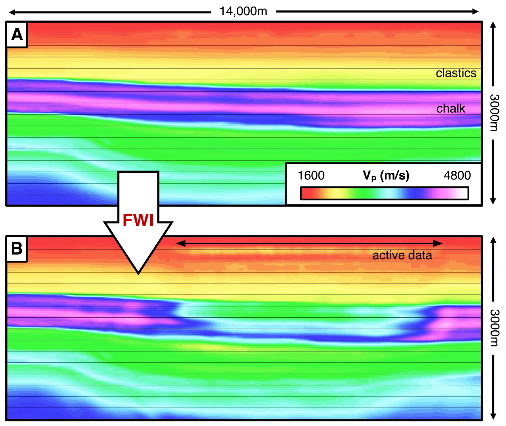
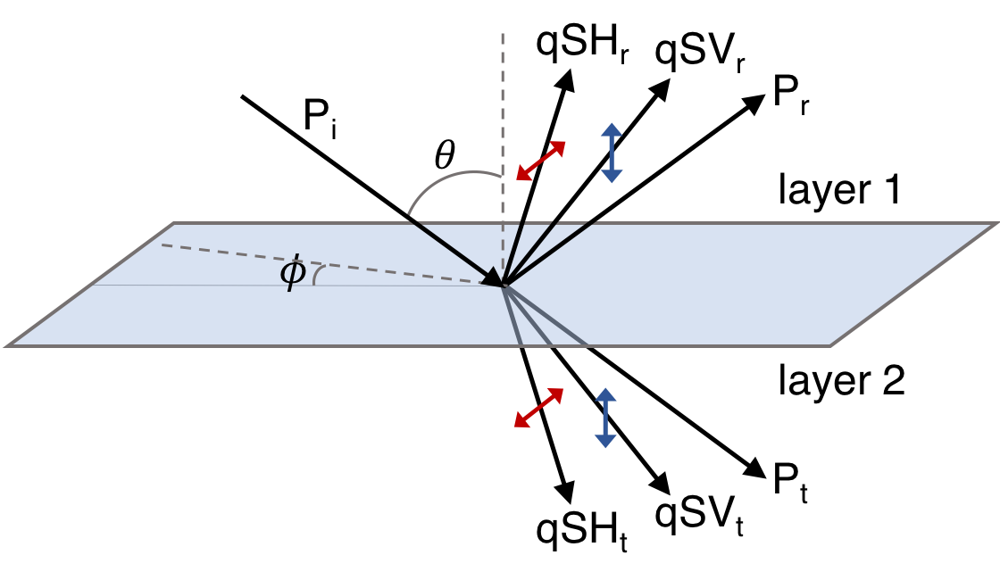

# ARC-seismic

<b>A</b>nisotropic <b>R</b>eflection <b>C</b>oefficient seismic modelling software.
***

## 1. Introduction

ARC-seismic uses the Zoeppritz equations to compute exact reflection coefficients for anisotropic elastic media across all angles of incidence (0$^{\circ}-$90$^{\circ}$), including post-critical angles. It consists of 3 individual programs:
> 1. **_zoeppritz.py_** - Comprehensive code for modelling reflection and transmission coefficients for isotropic and anisotropic elastic media in three dimensions.
>
> 
> 2. **_montecarlo.py_** - A code that uses zoeppritz.py to conduct Monte Carlo simulations of reflection coefficients.
>
>
> 3. **_kirchhoff.py_** - Kirchhoff program that uses zoeppritz.py to generate synthetic seismograms of the reflected finite frequency wave-field. 

The zoeppritz.py code has been validated using exact plane-wave reflection coefficient solutions, and the only condition it requires is that both media possess at least **_monoclinic symmetry_**, defined by an elastic tensor of the form:

$$\mathbf{C}_{ij} = \begin{bmatrix}
C_{11} & C_{12} & C_{13} &  &  & C_{16}\\ 
C_{12} & C_{22} & C_{23} &  &  & C_{26}\\ 
C_{13} & C_{23} & C_{33} &  &  & C_{36}\\ 
 &  &  & C_{44} & C_{45} & \\ 
 &  &  & C_{45} & C_{55} & \\ 
C_{16} & C_{26} & C_{36} &  &  & C_{66}
\end{bmatrix}$$

***

## 2. Background & Motivation

ARC-seismic was initially developed to use the anisotropic Zoeppritz equations to investigate a seismic data set, the Buzzard Field, where acoustic Full-Waveform Inversion (FWI) fails (see Figure 1). I was initially surprised when I couldn't find a program online that accurately solved the anisotropic Zoeppritz equations for pre- and post-critical incidence angles. It turns out that developing an accurate and robust anisotropic Zoeppritz modelling program is a challenging task$^{\textbf{(2)}}$, requiring the solution to multiple eigenvalue problems and the correct handling of complex numbers. 

Using ARC-seismic, it was discovered that the failure of acoustic FWI on the Buzzard Field was a consequence of post-critical elastic effects originating from an unconformable top-chalk interface, which resulted in almost zero post-critical energy being reflected. It was also discovered that post-critical reflection coefficients are highly sensitive to weak/moderate anisotropy within the reflecting medium of an interface.

For a detailed case study example, please refer to my thesis: *'The Limitations of Acoustic Full-Waveform Inversion in an Elastic World'*.

>  
> 
> **Figure 1. A)** Starting reverse time migrated p-wave velocity model. The high chalk velocities have been verified using common-image gathers.  **B)** Acoustic FWI recovered p-wave velocity model. Acoustic FWI clearly fails to recover the high p-wave velocities of the chalk in the starting model.

***

## 3. Theory

The Zoeppritz equations$^{\textbf{(1)}}$ govern the proportion of seismic energy that is reflected and transmitted from an interface between two homogenous elastic media (see Figure 2). They are formulated by assuming the solution to the wave equation: 

$$\left (  \rho\ \delta_{ij}\ \frac{\partial^2 }{\partial t^2}\ -\ \mathbf{C}_{ikjm}\ \frac{\partial^2 }{\partial x_{k}\partial x_{m}} \right )u_{j}=0,\ \ \ i=1,2,3,$$

takes the form of an elastic plane wave:

$$u_{i} = q_{i}\ exp\left [ i\omega\left ( t\ -\ s_{k}\ x_{k} \right ) \right ],\ \ \ i=1,2,3,$$

where $\rho$ is the density, $\mathbf{\delta}_{ij}$ is the Kronecker delta function, $\mathbf{C}_{ikjm}$ is the fourth order elastic tensor, $u_{ij}$ is the displacement, $q_{ij}$ is the polarization vector, $s_{km}$ is the slowness vector and $\omega$ is the angular frequency. This yields the following equation: 

$$\rho\ q_{i} = \mathbf{C}_{ikjm}\ s_{k}\ s_{m}\ q_{j},\ \ \ i=1,2,3,$$

$\mathbf{C}_{ikjm}$ governs the three-dimensional relationship between stress and strain in a medium. It was condensed into a more convenient second order 6$\times$6 matrix, $\mathbf{C}_{ij}$, by exploiting its symmetrical properties. The previous equation can then be rearranged and expressed as:

$$\left ( \mathbf{\Gamma}-\rho \mathbf{I}\right )\mathbf{q} = 0$$

where $\mathbf{\Gamma}$ is the 3$\times$3 Christoffel matrix, defined for media with monoclinic symmetry as follows:

$$\begin{matrix} 
\Gamma_{11}=C_{11}s_{1}^{2}+C_{66}s_{2}^{2}+C_{55}s_{3}^{2}+2C_{16}s_{1}s_{2}\\ 
\Gamma_{22}=C_{66}s_{1}^{2}+C_{22}s_{2}^{2}+C_{44}s_{3}^{2}+2C_{26}s_{1}s_{2}\\ 
\Gamma_{33}=C_{55}s_{1}^{2}+C_{44}s_{2}^{2}+C_{33}s_{3}^{2}+2C_{45}s_{1}s_{2}\\ 
\Gamma_{12}=\Gamma_{21}=C_{16}s_{1}^{2}+C_{26}s_{2}^{2}+C_{45}s_{3}^{2}+(C_{12}+C_{66})s_{1}s_{2}\\ 
\Gamma_{13}=\Gamma_{31}=(C_{13}+C_{55})s_{1}s_{3}+(C_{36}+C_{45})s_{2}s_{3}\\ 
\Gamma_{23}=\Gamma_{32}=(C_{36}+C_{45})s_{1}s_{3}+(C_{23}+C_{44})s_{2}s_{3}.
\end{matrix}$$

Explicit solutions for the reflection and transmission coefficients of incident P and S-waves were then found by imposing continuity of displacement and traction across the interface$^{\textbf{(1)}}$.

>  
> 
> **Figure 2.** Diagram of the system defined by the anisotropic Zoeppritz equations. $Pi$ is the incident p-wave, $Pr$ and $Pt$ are the reflected and transmitted p-waves, $qSHr$, $qSHt$, $qSVr$, $qSVt$ are the reflected and transmitted s-waves polarized in the quasi-horizontal/vertical planes, $\theta$ is the incidence angle and $\phi$ is the azimuth angle.

For a comprehensive discussion of the theory and methods used, please refer to my masters thesis.

***

# References
> 1. Zoeppritz, K. (1919), ‘Erdbebenwellen VIII B, Uber Reflexion and Durchgang seismischer wellen durch Unstetigkeisflachen’, *Gottinger Nachr* **1**, 66–84.
> 
>
> 2. Schoenberg, M. & Protazio, J. (1990), ‘Zoeppritz rationalized, and generalized to anisotropic media’, *The Journal of the Acoustical Society of America* **88**(S1), S46–S46.
>
>
> 3. Aki, K. & Richards, P. (1980), *Quantitative seismology; theory and methods*, Freeman Co., San Francisco.
>
>
> 4. Thomsen, L. (1986), ‘Weak elastic anisotropy’, *Geophysics* **51**(10), 1954–1966.
>
>
> 5. Bond, W. L. (1943), ‘The mathematics of the physical properties of crystals’, *Bell Labs Technical Journal* **22**(1), 1–72.
>
>
> 6. Shearer, P. M. (2009), *Introduction to seismology*, Cambridge University Press.